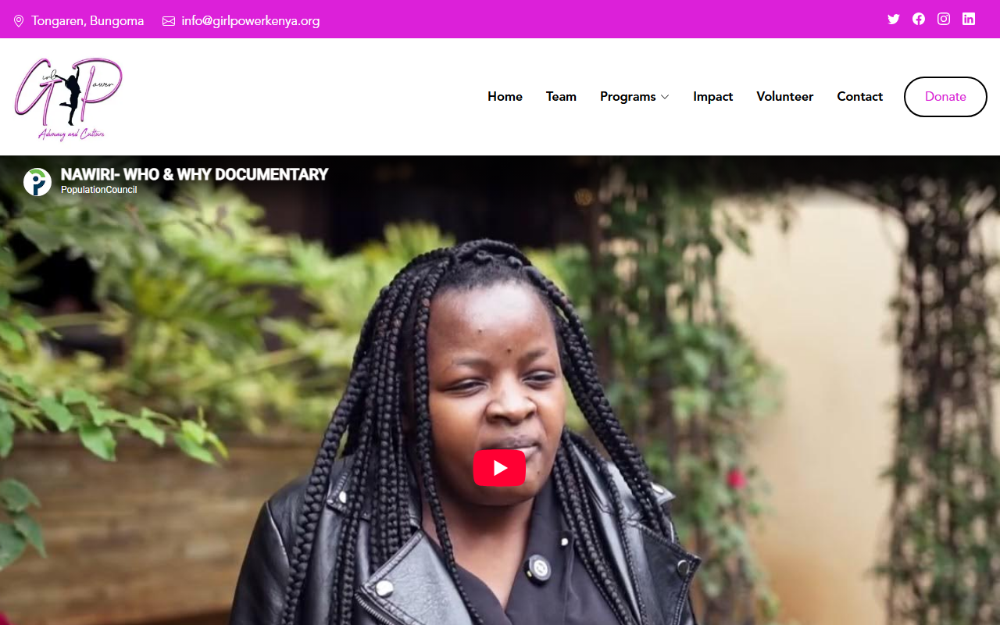

# Hi, I'm Wycliffe Cheruiyot 👋

**Full-Stack Engineer — AI Integration & Evaluation**
Nairobi, Kenya · CS graduate, Kisii University (Dec 2025)

I build production systems that integrate LLMs (retrieval pipelines, on-demand
GPU inference, cost-aware architecture) and design rigorous evaluation tasks
that test frontier AI models on real-world reasoning, coding, and analytical
problems.

📫 wycliffearapcheruiyot@gmail.com · [LinkedIn](https://www.linkedin.com/in/wycliffearapcheruiyot) · +254 791 775 477

---

## About

Since October 2025 I've worked as an independent contractor with **AfterQuery**,
designing evaluation tasks for frontier AI models — PyTorch/JAX kernel
correctness, real-world software bugs with reproducible test suites, and
long-horizon analytical decision problems, each with weighted grading rubrics
built to be deterministic and hard to game.

Alongside that, I've been the volunteer IT Lead at **Girlpower Organisation
Kenya** since 2022, where I built their content-managed website from scratch
(Next.js + FastAPI + MongoDB Atlas) and run their day-to-day IT. In 2024 I
completed an IT attachment at **Kenya Power**, and in 2025 an AI-powered
cybersecurity platform I co-built for Kenyan SMEs was selected for a
Mozilla-funded showcase.

I'm currently looking for roles in **AI evaluation, applied AI, and
full-stack engineering**.

---

## Stack

**Also:** Render, Netlify, Modal, Kaggle GPU notebooks (on-demand inference),
Cloudinary, retrieval-augmented generation, Docker-based eval harnesses.

---

## Featured Projects

### 🔌 KPLC Chatbot System
A support chatbot for Kenya Power customers, built as **seven cooperating
services** rather than one monolith — gateway, two frontends, GPU inference,
dataset sync, knowledge-base builder, managed database layer. Runs inference
on a Kaggle GPU notebook that spins up on demand, keeping hosting cost near
zero.

**[Try it live →](https://kplc-chatbot-frontend.vercel.app/)** · [Source](https://github.com/wycliffearapcheruiyot/kplc-chatbot-system)

---

### 🌍 Girlpower Organisation Kenya — Website & CMS
A full content-managed platform for a Nairobi-based nonprofit: a public
Next.js site with no content of its own — every page, image, and form is
driven by a FastAPI + MongoDB Atlas backend, edited through a dedicated
admin panel and published with one click.

**[Visit the live site →](https://girlpower-web.vercel.app)**

<!--GIRLPOWER_SCREENSHOT:START-->

<!--GIRLPOWER_SCREENSHOT:END-->

> **Note on the source:** this is a live system handling a real nonprofit's
> data (staff logins, volunteer records), so I'm keeping the codebase private
> out of respect for the organization — happy to walk through the
> architecture and code directly in an interview.

---

### 🧪 AI Evaluation Task Design (AfterQuery)
I design evaluation tasks for frontier AI models — Docker-based test
harnesses, scored rubrics, and adversarial test cases that catch scoring bugs
before they reach production grading.

> Most of this work is kept private under client contract terms. One task
> package is public as a representative sample — it shows the full iteration
> history (v1 → v12+) of hardening a rubric against edge cases and scoring
> bugs:

**[electronics-line-quality-comparison →](https://github.com/wycliffearapcheruiyot/electronics-line-quality-comparison)**

---

## Latest Activity
<!--LATEST_PROJECTS:START-->
- **[wycliffearapcheruiyot](https://github.com/wycliffearapcheruiyot/wycliffearapcheruiyot)** — Profile README  
  _last pushed 2026-09-24_
- **[kplc-chatbot-system](https://github.com/wycliffearapcheruiyot/kplc-chatbot-system)** — Overview and architecture map of the KPLC chatbot system  
  _last pushed 2026-09-24_
- **[kplc-chatbot-db-infra](https://github.com/wycliffearapcheruiyot/kplc-chatbot-db-infra)** — MongoDB Atlas setup for the chatbot system shared state  
  _last pushed 2026-09-24_
- **[kplc-chatbot-kb-builder](https://github.com/wycliffearapcheruiyot/kplc-chatbot-kb-builder)** — Builds and verifies the chatbot knowledge-base data  
  _last pushed 2026-09-24_
- **[kplc-chatbot-dataset-sync](https://github.com/wycliffearapcheruiyot/kplc-chatbot-dataset-sync)** — Keeps the model dataset synced from Hugging Face to Kaggle on demand - FastAPI  
  _last pushed 2026-09-24_
<!--LATEST_PROJECTS:END-->

---

Last updated: <!--LAST_UPDATED:START-->2026-09-24 22:17 UTC<!--LAST_UPDATED:END-->
